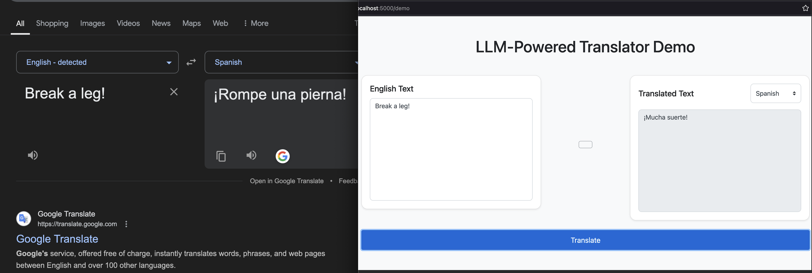

# llm-transl8r

---

## Building an LLM-Powered Translator with Dynamic Language Support



---

## Table of Contents

- [Introduction](#introduction)
- [Why Use LLMs for Translation?](#why-use-llms-for-translation)
- [Setting Up the Flask Application](#setting-up-the-flask-application)
  - [Prerequisites](#prerequisites)
- [Implementing the Translator](#implementing-the-translator)
  - [Initializing the Azure OpenAI Client](#initializing-the-azure-openai-client)
  - [Crafting the Translation Function](#crafting-the-translation-function)
  - [Creating the Translation Endpoint](#creating-the-translation-endpoint)
  - [Developing the Demo Interface](#developing-the-demo-interface)
- [Enhancing the Google Translate Integration](#enhancing-the-google-translate-integration)
  - [Dynamic Language Parameters](#dynamic-language-parameters)
  - [Updating the JavaScript Function](#updating-the-javascript-function)
- [Running the Application](#running-the-application)
- [Conclusion](#conclusion)

## Introduction

In today's globalized world, effective communication across different languages is more important than ever. Traditional translation tools often struggle with idiomatic expressions and cultural nuances. By leveraging Large Language Models (LLMs) like GPT-4, we can create a more sophisticated translator that understands context and provides more natural translations.

In this tutorial, we'll build a web-based translator using Flask and Azure OpenAI's GPT-4 model. We'll also integrate Google Translate for comparison and ensure that the language parameters update dynamically based on user selection.

## Why Use LLMs for Translation?

LLMs excel in understanding context, nuance, and cultural references, making them ideal for translating idiomatic expressions that traditional translators might misinterpret. By using an LLM, we can provide translations that are not only accurate but also culturally appropriate and natural-sounding.

**Example:**

- **English Text:** "Break a leg!"
- **Traditional Translation (to Spanish):** "¡Rompe una pierna!"
- **LLM Translation:** "¡Mucha suerte!"

The LLM recognizes that "Break a leg" is an idiomatic expression meaning "Good luck" and provides an equivalent expression in the target language.


## Setting Up the Flask Application

### Prerequisites

Ensure you have Python 3.x installed and install the required packages:

```bash
pip install flask openai
```

- `demo.py`: The main Flask application containing our code.

## Implementing the Translator

Let's dive into the code and understand how each part contributes to the application.

### Initializing the Azure OpenAI Client

First, we initialize the Azure OpenAI client with our credentials.

```python
from flask import Flask, request, jsonify, render_template_string
from openai import AzureOpenAI

app = Flask(__name__)

# Initialize the Azure OpenAI client
client = AzureOpenAI(
    api_key="YOUR_API_KEY",
    api_version="2024-10-21",
    azure_endpoint="https://YOUR_RESOURCE_NAME.openai.azure.com"
)
```

**Note:** Replace `YOUR_API_KEY` and `YOUR_RESOURCE_NAME` with your actual Azure OpenAI credentials.

### Crafting the Translation Function

We define a function `translate_text` that sends a prompt to the LLM to translate the given text from the source language to the target language.

```python
def translate_text(text, source_language, target_language):
    system_message = f"""
You are a professional translator proficient in translating {source_language} text into {target_language}.
Your task is to provide an accurate and natural-sounding translation of the given {source_language} text into {target_language}.

Instructions:
- Only provide the translated text.
- Do not include the original {source_language} text.
- Do not add any explanations, notes, or extra information.
- Do not start or end the response with phrases like 'Translation:', 'Here is the translation:', etc.
- Ensure proper grammar, spelling, and punctuation in {target_language}.
- Preserve the original meaning and tone of the text.

If the text contains idioms, expressions, or cultural references, translate them appropriately so they make sense to a native {target_language} speaker.
"""

    user_input = text

    response = client.chat.completions.create(
        model="gpt-4",  # Replace with your desired model
        messages=[
            {"role": "system", "content": system_message.strip()},
            {"role": "user", "content": user_input.strip()}
        ],
        max_tokens=1000,  # Adjust if you expect longer translations
        temperature=0.3
    )

    return response.choices[0].message.content.strip()
```

**Key Points:**

- **Prompt Engineering:** The `system_message` provides clear instructions to the LLM, ensuring accurate and context-aware translations.
- **Dynamic Languages:** The function now accepts `source_language` and `target_language`, allowing for translations between any supported languages.
- **Temperature Setting:** A low temperature (0.3) is used to make the output more deterministic.
- **Model Selection:** Using `gpt-4o` for high-quality translations.

### Creating the Translation Endpoint

We set up a `/translate` endpoint that accepts POST requests with JSON data containing the text to be translated, the source language, and the target language.

```python
@app.route('/translate', methods=['POST'])
def translate():
    data = request.get_json()
    if data is None:
        return jsonify({'error': 'Invalid JSON input'}), 400
    source_text = data.get('source_text')
    source_language = data.get('source_language')
    target_language = data.get('target_language')

    if source_language == 'Select one' or target_language == 'Select one':
        return jsonify({'error': 'Please select both source and target languages'}), 400
    if not source_text or not source_language or not target_language:
        return jsonify({'error': 'Invalid input parameters'}), 400

    translated_text = translate_text(source_text, source_language, target_language)

    return jsonify({
        'original': source_text,
        'translated': translated_text,
        'source_language': source_language,
        'target_language': target_language
    })
```

### Developing the Demo Interface

We create a `/demo` endpoint that serves an HTML page with an interactive translation interface.

```python
@app.route('/demo', methods=['GET'])
def demo():
    languages = [
        'English', 'Spanish', 'French', 'German', 'Italian', 'Chinese', 'Japanese',
        'Korean', 'Russian', 'Portuguese', 'Arabic'
    ]

    return render_template_string("""
    <!-- HTML content here -->
    """, languages=languages)
```

**HTML Template Highlights:**

- **Language Selection:** Dynamic dropdowns for selecting source and target languages.
- **Responsive Design:** Uses Bootstrap for a modern look and feel.
- **Interactive Elements:** Textareas for input and output, a translate button, and a "Check in Google" button.
- **JavaScript Logic:** Handles dynamic updates of language options and integrates with Google Translate.

**Example HTML Snippet:**

```html
<select id="source_language" class="custom-select w-auto" onchange="updateTargetLanguages()">
    <option selected disabled>Select one</option>
    
        <option value="{{ lang }}">{{ lang }}</option>
    
</select>
```

This dropdown allows users to select the source language, triggering an update of available target languages.

## Enhancing the Google Translate Integration

### Dynamic Language Parameters

To compare our LLM translations with Google Translate, we added a "Check in Google" button that opens Google Translate with the user's input and selected languages. The key improvement is dynamically updating the `hl` (user interface language), `sl` (source language), and `tl` (target language) parameters based on user selections.

**Language Codes Mapping:**

```javascript
var languageCodes = {
    'English': 'en',
    'Spanish': 'es',
    'French': 'fr',
    'German': 'de',
    'Italian': 'it',
    'Chinese': 'zh-CN',
    'Japanese': 'ja',
    'Korean': 'ko',
    'Russian': 'ru',
    'Portuguese': 'pt',
    'Arabic': 'ar'
};
```

### Updating the JavaScript Function

We updated the `openGoogleTranslate` function to use the selected languages:

```javascript
function openGoogleTranslate() {
    var sourceText = document.getElementById('source_text').value;
    var sourceLanguage = $('#source_language').val();
    var targetLanguage = $('#target_language').val();

    var sourceCode = languageCodes[sourceLanguage];
    var targetCode = languageCodes[targetLanguage];

    if (!sourceCode || !targetCode) {
        alert('Please select both source and target languages.');
        return;
    }

    var url = "https://translate.google.com/?hl=" + sourceCode + "&sl=" + sourceCode + "&tl=" + targetCode + "&text=" + encodeURIComponent(sourceText);
    window.open(url, '_blank');
}
```

**Key Modifications:**

- **Dynamic Parameters:** The `hl`, `sl`, and `tl` parameters now reflect the user's selected languages.
- **Validation:** Ensures both languages are selected before proceeding.
- **User Experience:** Opens the Google Translate page in a new tab with the correct settings.

## Running the Application

1. **Set Your Azure OpenAI Credentials:**

   Replace the placeholder values in the `client` initialization with your actual API key and endpoint.

   ```python
   client = AzureOpenAI(
       api_key="YOUR_API_KEY",
       api_version="2024-10-21",
       azure_endpoint="https://YOUR_RESOURCE_NAME.openai.azure.com"
   )
   ```

2. **Install Dependencies:**

   Ensure all required libraries are installed.

   ```bash
   pip3 install flask openai
   ```

3. **Run the Flask App:**

   ```bash
   python3 demo.py
   ```

4. **Access the Demo:**

   Navigate to `http://localhost:5000/demo` in your web browser or [click here](http://localhost:5000/demo).

## Conclusion

By leveraging the power of LLMs and careful prompt engineering, we've built a translator that handles not only literal translations but also understands idiomatic expressions and cultural nuances. The integration with Google Translate allows users to compare results easily. This application demonstrates how modern AI models can enhance language translation tasks, providing more accurate and natural translations.

---

**Full Code Listing:**

```python
from flask import Flask, request, jsonify, render_template_string
from openai import AzureOpenAI

app = Flask(__name__)

# Initialize the AzureOpenAI client
client = AzureOpenAI(
    api_key="",  
    api_version="2024-10-21",
    azure_endpoint="https://demo.openai.azure.com"
)


def translate_text(text, source_language, target_language):
    system_message = f"""
You are a professional translator proficient in translating {source_language} text into {target_language}.
Your task is to provide an accurate and natural-sounding translation of the given {source_language} text into {target_language}.

Instructions:
- Only provide the translated text.
- Do not include the original {source_language} text.
- Do not add any explanations, notes, or extra information.
- Do not start or end the response with phrases like 'Translation:', 'Here is the translation:', etc.
- Ensure proper grammar, spelling, and punctuation in {target_language}.
- Preserve the original meaning and tone of the text.

If the text contains idioms, expressions, or cultural references, translate them appropriately so they make sense to a native {target_language} speaker.
"""

    user_input = text

    response = client.chat.completions.create(
        model="gpt-4",  # Replace with your desired model
        messages=[
            {"role": "system", "content": system_message.strip()},
            {"role": "user", "content": user_input.strip()}
        ],
        max_tokens=1000,  # Adjust if you expect longer translations
        temperature=0.3
    )

    return response.choices[0].message.content.strip()


@app.route('/translate', methods=['POST'])
def translate():
    data = request.get_json()
    if data is None:
        return jsonify({'error': 'Invalid JSON input'}), 400
    source_text = data.get('source_text')
    source_language = data.get('source_language')
    target_language = data.get('target_language')

    if source_language == 'Select one' or target_language == 'Select one':
        return jsonify({'error': 'Please select both source and target languages'}), 400
    if not source_text or not source_language or not target_language:
        return jsonify({'error': 'Invalid input parameters'}), 400

    translated_text = translate_text(source_text, source_language, target_language)

    return jsonify({
        'original': source_text,
        'translated': translated_text,
        'source_language': source_language,
        'target_language': target_language
    })

@app.route('/demo', methods=['GET'])
def demo():
    languages = [
        'English', 'Spanish', 'French', 'German', 'Italian', 'Chinese', 'Japanese',
        'Korean', 'Russian', 'Portuguese', 'Arabic'
    ]

    return render_template_string("""
<!DOCTYPE html>
<html>
<head>
    <title>LLM Translator Demo</title>
    <!-- Bootstrap CSS -->
    <link
      rel="stylesheet"
      href="https://stackpath.bootstrapcdn.com/bootstrap/4.5.2/css/bootstrap.min.css"
    />
    <style>
        body {
            background-color: #f8f9fa;
        }
        .translator-container {
            margin-top: 50px;
        }
        .card {
            border-radius: 15px;
        }
        .translate-button {
            width: 100%;
            font-size: 18px;
            padding: 10px;
        }
        #loading {
            display: none;
            text-align: center;
            margin-top: 20px;
        }
        .fade-in {
            animation: fadeIn 0.5s;
        }
        @keyframes fadeIn {
            from { opacity: 0; }
            to { opacity: 1; }
        }
        .custom-select, .form-control {
            height: calc(2.25rem + 12px);
            border-radius: 0.5rem;
        }
        .textarea-resize-none {
            resize: none;
        }
    </style>
    <link rel="stylesheet" href="https://cdnjs.cloudflare.com/ajax/libs/font-awesome/5.15.4/css/all.min.css">
    <!-- jQuery and Bootstrap JS -->
    <script src="https://code.jquery.com/jquery-3.5.1.min.js"></script>
    <script
      src="https://stackpath.bootstrapcdn.com/bootstrap/4.5.2/js/bootstrap.bundle.min.js"
    ></script>
</head>
<body>
    <div class="container translator-container">
        <h1 class="text-center mb-5">LLM-Powered Translator Demo</h1>
        <div class="row">
            <div class="col-md-5">
                <div class="card shadow-sm">
                    <div class="card-body">
                        <div class="d-flex justify-content-between align-items-center">
                            <h5 class="card-title mb-0">Source Text</h5>
                            <select id="source_language" class="custom-select w-auto" onchange="updateTargetLanguages()">
                                <option selected disabled>Select one</option>
                                
                                    <option value="{{ lang }}">{{ lang }}</option>
                                
                            </select>
                        </div>
                        <textarea id="source_text" class="form-control textarea-resize-none mt-3" rows="10" placeholder="Enter source text here..."></textarea>
                    </div>
                </div>
            </div>
            <div class="col-md-2 text-center my-auto">
                <button id="swap_languages" class="btn btn-outline-secondary btn-lg mb-3" disabled>
                    <i class="fas fa-exchange-alt"></i>
                </button>
            </div>
            <div class="col-md-5">
                <div class="card shadow-sm">
                    <div class="card-body">
                        <div class="d-flex justify-content-between align-items-center">
                            <h5 class="card-title mb-0">Translated Text</h5>
                            <select id="target_language" class="custom-select w-auto">
                                <option selected disabled>Select one</option>
                                
                                    <option value="{{ lang }}">{{ lang }}</option>
                                
                            </select>
                        </div>
                        <textarea id="translated_text" class="form-control textarea-resize-none mt-3" rows="10" placeholder="Translation will appear here..." readonly></textarea>
                    </div>
                </div>
            </div>
        </div>
        <div class="row mt-4">
            <div class="col text-center">
                <button class="btn btn-primary translate-button" id="translate_button">Translate</button>
                <hr />
                <button id="check_in_google" class="btn btn-secondary" onclick="openGoogleTranslate()">Check in Google</button>
            </div>
        </div>
        <div id="loading">
            <div class="spinner-border text-primary" role="status">
              <span class="sr-only">Translating...</span>
            </div>
            <p class="mt-2">Translating...</p>
        </div>
    </div>
    <!-- Font Awesome for Icons -->
    <script
      src="https://cdnjs.cloudflare.com/ajax/libs/font-awesome/5.15.1/js/all.min.js"
      crossorigin="anonymous"
    ></script>
    <script>
        var languages = {{ languages | tojson }};
        var languageCodes = {
            'English': 'en',
            'Spanish': 'es',
            'French': 'fr',
            'German': 'de',
            'Italian': 'it',
            'Chinese': 'zh-CN',
            'Japanese': 'ja',
            'Korean': 'ko',
            'Russian': 'ru',
            'Portuguese': 'pt',
            'Arabic': 'ar'
        };
        function updateTargetLanguages() {
            var sourceLanguage = $('#source_language').val();
            var targetLanguageSelect = $('#target_language');
            targetLanguageSelect.empty();
            targetLanguageSelect.append('<option selected disabled>Select one</option>');
            for (var i = 0; i < languages.length; i++) {
                if (languages[i] !== sourceLanguage) {
                    targetLanguageSelect.append('<option value="' + languages[i] + '">' + languages[i] + '</option>');
                }
            }
        }
        function openGoogleTranslate() {
            var sourceText = document.getElementById('source_text').value;
            var sourceLanguage = $('#source_language').val();
            var targetLanguage = $('#target_language').val();

            var sourceCode = languageCodes[sourceLanguage];
            var targetCode = languageCodes[targetLanguage];

            if (!sourceCode || !targetCode) {
                alert('Please select both source and target languages.');
                return;
            }

            var url = "https://translate.google.com/?hl=en&sl=" + sourceCode + "&tl=" + targetCode + "&text=" + encodeURIComponent(sourceText);
            window.open(url, '_blank');
        }
        $(document).ready(function() {
            $('#translate_button').click(function() {
                var sourceText = $('#source_text').val().trim();
                var sourceLanguage = $('#source_language').val();
                var targetLanguage = $('#target_language').val();

                if (sourceText === '') {
                    $('#source_text').addClass('is-invalid');
                    return;
                } else {
                    $('#source_text').removeClass('is-invalid');
                }

                $('#translated_text').val('');
                $('#loading').fadeIn();

                $.ajax({
                    url: '/translate',
                    type: 'POST',
                    contentType: 'application/json',
                    data: JSON.stringify({
                        source_text: sourceText,
                        source_language: sourceLanguage,
                        target_language: targetLanguage
                    }),
                    success: function(response) {
                        $('#loading').fadeOut();
                        $('#translated_text').val(response.translated).addClass('fade-in');
                    },
                    error: function() {
                        $('#loading').fadeOut();
                        alert('An error occurred while translating. Please try again.');
                    }
                });
            });

            $('#source_text').on('input', function() {
                if ($(this).val().trim() !== '') {
                    $(this).removeClass('is-invalid');
                }
            });
        });
    </script>
</body>
</html>
""", languages=languages)

if __name__ == '__main__':
    app.run(debug=True)

```

---

Feel free to customize and expand upon this code to suit your specific needs. Happy translating!
